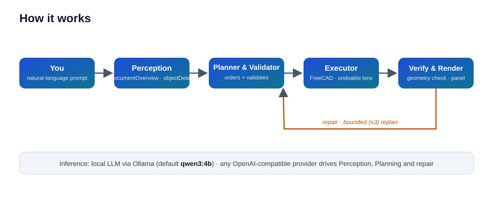

<div align="center">


# FreeCAD Agent

**A local-AI copilot for FreeCAD** — describe a part in plain English and it performs
**real modeling actions** inside FreeCAD, from a single box to a whole multi-step component.
It runs on a **local** language model via Ollama (nothing leaves your machine) and sits on an
**unmodified** FreeCAD: this is an add-on, not a fork.

     

</div>

> ### ⚠️ Status: MVP · `v0.13.0`
> Works end-to-end and has been validated on real multi-step parts — it now builds a whole part
> from one paragraph, **asks when a crucial value is missing**, and remembers the session. It is
> still an **early, non-commercial hobby/research project**. Read [Limits](#limits) before
> relying on it — honesty first.
>
> **[▶ Watch the demo](https://dai.ly/xamziuq)** · 2½ min (wait times trimmed) ·
> [mp4 in this repo](docs/media/demo.mp4)

## Table of contents

- [Highlights](#highlights)
- [What you can model](#what-you-can-model)
- [How it works](#how-it-works)
- [Install](#install)
- [Quick start](#quick-start)
- [Example prompts](#example-prompts)
- [Privacy](#privacy)
- [Development](#development)
- [Limits](#limits)
- [Contributing](#contributing)
- [License](#license)

## Highlights

- 🖱️ **Prompt → model.** Type a request; the agent perceives the document, plans the steps, and executes them as structured CAD commands inside **undoable transactions** — `Ctrl+Z` reverts any action.
- 🧭 **Asks when unsure.** If a crucial value is missing, a card offers a proposed default. Never a permission prompt; at most **3 questions per request**.
- 🧠 **Session memory.** A RAM-only summary of what you asked earlier, so *"now drill a hole in its centre"* resolves to the right object. Nothing is written to disk.
- 🔒 **Local & private.** No telemetry, no cloud, nothing leaves your machine — the panel carries a fixed **Local AI** badge.
- 🛠️ **20 structured commands** on the Part workbench, resolved from **real geometry** (never guessed); falls back to **free Python** (shown to you first) when the vocabulary isn't enough.

## What you can model

The agent has a small, structured vocabulary on the Part workbench. Each command is
**resolved from the actual geometry** of your document, not from a guessed bounding box.

| Category | Commands |
| --- | --- |
| **Solids** | box, cylinder, cone (+ truncated), sphere, torus |
| **Sketches** | rectangle, circle, regular polygon, rounded slot, closed polyline |
| **Operations** | extrude, pocket, revolve, loft, sweep, shell (hollow) |
| **Features** | drill hole, boolean (union / difference / intersection), fillet, chamfer |
| **Transform** | move, rotate, mirror, linear array, polar array |

> The vocabulary is intentionally small. If a command isn't in the list, the agent writes and
> shows you the equivalent **Python** first.

## How it works

<div align="center">



</div>

1. **Perception** — the agent asks Ollama to describe the document and the selected objects
   (ADR 0003, 0006). It never guesses coordinates.
2. **Planner & Validator** — it plans an ordered set of commands and validates each one against
   the real geometry, resolving coordinates (ADR 0007).
3. **Executor** — it applies commands as **undoable transactions** in FreeCAD (ADR 0002).
4. **Verify & Render** — it checks the geometry, repairs if needed, and shows you the result
   and the resulting Python.

A **bounded repair loop** (≤ 3 replans) closes the gap when the first attempt doesn't match the
intended geometry — never an infinite retry.

> Everything the agent does is backed by an **ADR** in [`docs/adr/`](docs/adr/); the shared
> contracts live in [`shared/`](shared/).

## Install

This is a FreeCAD **add-on** (a workbench) for an unmodified FreeCAD.

**Windows (recommended):** run [`INSTALL_ADDON.bat`](INSTALL_ADDON.bat) — it copies a clean local
copy into FreeCAD's `Mod` folder. No administrator rights required.

**macOS / Linux (manual):** copy this folder to FreeCAD's Mod directory:

| OS | Target |
| --- | --- |
| Windows | `%APPDATA%\FreeCAD\Mod\` |
| macOS | `~/Library/Application Support/FreeCAD/Mod/` |
| Linux | `~/.local/share/FreeCAD/Mod/` |

Put it at `.../Mod/FreeCADAgent/`.

## Quick start

1. Install and run [Ollama](https://ollama.com/download), then pull a model (default is
   `qwen3:4b`, but any works):
   ```bash
   ollama pull qwen3:4b
   ```
2. Install the add-on ([`INSTALL_ADDON.bat`](INSTALL_ADDON.bat) on Windows; see
   [Install](#install) elsewhere).
3. Reopen FreeCAD, select the **FreeCAD Agent** workbench, and click **Connect**. The engine
   starts by itself (Ollama auto-starts if needed).
4. Type a request in the panel. If the agent needs a value, it shows a card with a proposed
   default — approve or edit.

> Requires: **FreeCAD 1.1.x**, **Python 3.10+** (bundled with FreeCAD — the engine is pure
> standard library), and a running **Ollama** with a model. Windows, macOS, and Linux.

## Example prompts

- *"Create a box 50x50x12 and drill a 10 mm hole in the centre."*
- *"Make a mounting bracket: a base plate 60x40x10, cut a 30x20 pocket 5 mm deep into its top face, drill two 5 mm holes at [10,20] and [50,20], and chamfer the vertical edges by 1."*

## Privacy

The panel carries a fixed **Local AI** badge. The engine talks to a local Ollama endpoint (or any
OpenAI-compatible provider you configure); it sends **no telemetry** and writes **nothing** to the
cloud. Session memory lives only in RAM and disappears when FreeCAD closes.

## Development

- **Tests:** 53 tests across 31 modules. Run them on Windows with
  [`RUN_ALL_TESTS.bat`](RUN_ALL_TESTS.bat), or run `tests/test_*.py` with any Python 3.10+.
  The suite is **headless** — it needs neither FreeCAD nor Ollama.
- **Architecture:** a pure-Python, standard-library-only engine that runs on FreeCAD's bundled
  interpreter. The structured 20-command vocabulary is resolved from real geometry by the
  executor. Design decisions are recorded as ADRs in [`docs/adr/`](docs/adr/); shared JSON-Schema
  contracts live in [`shared/`](shared/).

## Limits

- **Small local models.** Keep requests to ~6–8 features and give **explicit dimensions and
  positions** — the smaller the model, the more it depends on you.
- **Early MVP.** Non-commercial, work-in-progress. If something misbehaves, the panel shows the
  exact Python it ran, so you can always inspect or edit it.

## Contributing

Bug reports, feedback, and PRs are welcome — especially **macOS/Linux test reports** and extra
examples of phrases that work (or break). When you file an issue, please include:

- OS, FreeCAD version, and the exact phrase you typed.
- The **panel log** and **engine log** (the panel has buttons to copy both).

## License

Distributed under the terms of the **LGPL-2.1-or-later** license — see [`LICENSE`](LICENSE).

---

**Related:** [FreeCAD](https://www.freecad.org/) · [Ollama](https://ollama.com/)
